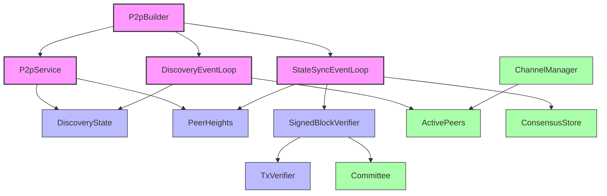
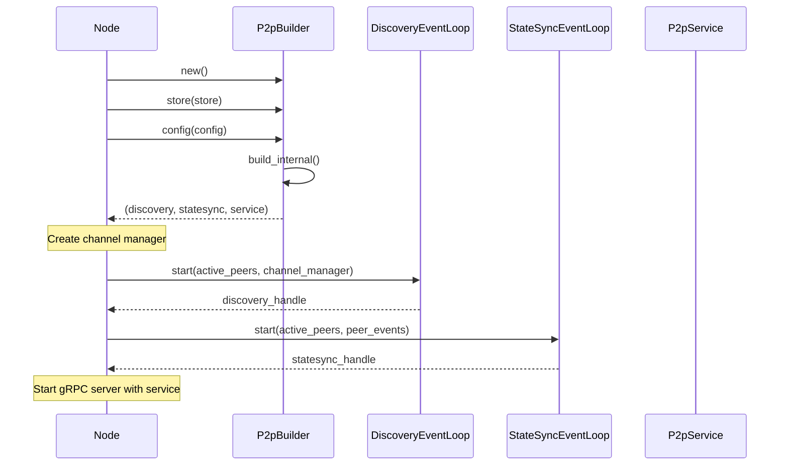

# P2P Module Structure

## Purpose and Scope
This document details the architectural structure of the P2P module in the Soma blockchain, explaining its components, their responsibilities, and their relationships. It provides a comprehensive view of how these components interact to enable peer-to-peer communication and state synchronization.

## Component Architecture

The P2P module is structured around several key components that work together to provide network discovery, state synchronization, and message propagation services:

## Component Descriptions

### Core Components

#### P2pService
- **Purpose**: Implements the gRPC service for handling network requests
- **Responsibilities**:
  - Handling peer discovery requests
  - Processing block and commit fetch requests
  - Managing commit propagation
  - Routing state sync messages
- **Key Methods**:
  - `get_known_peers`: Handle peer discovery requests
  - `fetch_blocks`: Serve block fetch requests
  - `fetch_commits`: Serve commit fetch requests
  - `push_commit`: Process commit propagation
- **State**:
  - References to `DiscoveryState` and `PeerHeights`
  - Access to the consensus store
  - Channels to send messages to discovery and state sync loops

#### DiscoveryEventLoop
- **Purpose**: Manages peer discovery and connection establishment
- **Responsibilities**:
  - Announcing local node to the network
  - Discovering other nodes on the network
  - Managing and updating peer metadata
  - Establishing connections to new peers
- **Key Methods**:
  - `start`: Main event loop for discovery operations
  - `handle_tick`: Periodic discovery operations
  - `handle_peer_event`: Process peer connect/disconnect events
  - `query_connected_peers_for_their_known_peers`: Gather peer information
- **State**:
  - Local node information
  - Known peers list
  - Pending connection attempts
  - References to active peer connections

#### StateSyncEventLoop
- **Purpose**: Manages state synchronization between nodes
- **Responsibilities**:
  - Identifying state discrepancies
  - Fetching missing blocks and commits
  - Verifying fetched data
  - Applying updates to local state
- **Key Methods**:
  - `start`: Main event loop for state sync operations
  - `handle_message`: Process sync-related messages
  - `maybe_start_sync_task`: Initiate sync when behind
  - `handle_commit_from_consensus`: Process new local commits
- **State**:
  - Peer height information
  - Sync task tracking
  - References to consensus store
  - Block verifier for data integrity

#### P2pBuilder
- **Purpose**: Constructs and configures P2P components
- **Responsibilities**:
  - Creating and configuring all P2P components
  - Setting up communication channels
  - Initializing state objects
  - Providing unified construction interface
- **Key Methods**:
  - `build`: Create all P2P components
  - `build_internal`: Core component construction logic
  - `store`, `config`: Builder pattern methods
- **State**:
  - Configuration parameters
  - Store references
  - Component initialization state

### Support Components

#### DiscoveryState
- **Purpose**: Shared state for peer discovery
- **State**:
  - Local node information (`our_info`)
  - Known peer information (`known_peers`)
- **Access Pattern**: Protected by `RwLock` for concurrent access

#### PeerHeights
- **Purpose**: Tracking peer commit information
- **State**:
  - Mapping of peer IDs to their highest commit indices
  - Mapping of peer IDs to their lowest available commit indices
- **Methods**:
  - `update_peer_info`: Update a peer's commit information
  - `insert_peer_info`: Add new peer commit information
  - `highest_known_commit_index`: Get maximum known commit index

#### TxVerifier
- **Purpose**: Transaction verification during sync
- **Responsibilities**:
  - Verify transaction signatures
  - Validate transaction contents
  - Ensure transaction integrity
- **Dependencies**:
  - Committee information
  - Signature verification mechanisms

#### SignedBlockVerifier
- **Purpose**: Block verification during sync
- **Responsibilities**:
  - Verify block signatures
  - Validate block structure
  - Ensure block integrity
- **Dependencies**:
  - Transaction verifier
  - Committee information
  - Consensus context

## Initialization Flow

The initialization of the P2P module follows this sequence:

## Communication Channels

The P2P module uses various channels for communication:

1. **Discovery channels**:
   - `their_info_receiver`: Channel to receive peer information
   - `peer_events`: Channel to receive peer connect/disconnect events

2. **State Sync channels**:
   - `mailbox`: Channel to receive state sync messages
   - `weak_sender`: Weak reference to state sync message sender
   - `commit_event_sender`: Broadcast channel for commit events

3. **Service channels**:
   - `discovery_sender`: Channel to discovery for peer information
   - `state_sync_sender`: Channel to state sync for sync messages

## Component Lifecycle

### Startup Sequence
1. `P2pBuilder` creates all components and their shared state
2. Discovery event loop is started
3. State sync event loop is started
4. P2P service is registered with gRPC server

### Normal Operation
1. Discovery continuously updates peer information
2. State sync monitors for new commits from peers
3. State sync fetches missing blocks and commits
4. P2P service handles incoming network requests

### Shutdown Sequence
1. Node signals shutdown
2. Discovery and state sync loops gracefully terminate
3. P2P service stops accepting requests
4. Resources are released

## Integration with Other Modules

### Authority Module
- State sync delivers synchronized commits to authority
- Authority processes the transactions in these commits
- Authority provides blocks and commits to serve to other nodes

### Consensus Module
- State sync receives new commits from consensus
- Consensus verifies downloaded blocks during sync
- Committed blocks are propagated to other nodes

### Node Module
- Manages P2P component lifecycle
- Configures P2P components through builder
- Handles component startup and shutdown

## Verification Status

| Component | Verification Status | Confidence | Evidence |
|-----------|---------------------|------------|----------|
| P2pService | Verified-Code | 9/10 | Direct inspection of p2p/src/server.rs implementation |
| DiscoveryEventLoop | Verified-Code | 9/10 | Direct inspection of p2p/src/discovery/mod.rs implementation |
| StateSyncEventLoop | Verified-Code | 9/10 | Direct inspection of p2p/src/state_sync/mod.rs implementation |
| P2pBuilder | Verified-Code | 9/10 | Direct inspection of p2p/src/builder.rs implementation |
| Communication Flow | Verified-Code | 8/10 | Tracing channel usage across multiple files |
| Integration Points | Inferred | 7/10 | Based on interface patterns and references |

## Confidence: 9/10
This document provides a detailed and accurate representation of the P2P module's structure based on direct code inspection. The component relationships and responsibilities are well-documented, with clear evidence from the implementation.

## Last Updated: 2025-03-08 by Cline
