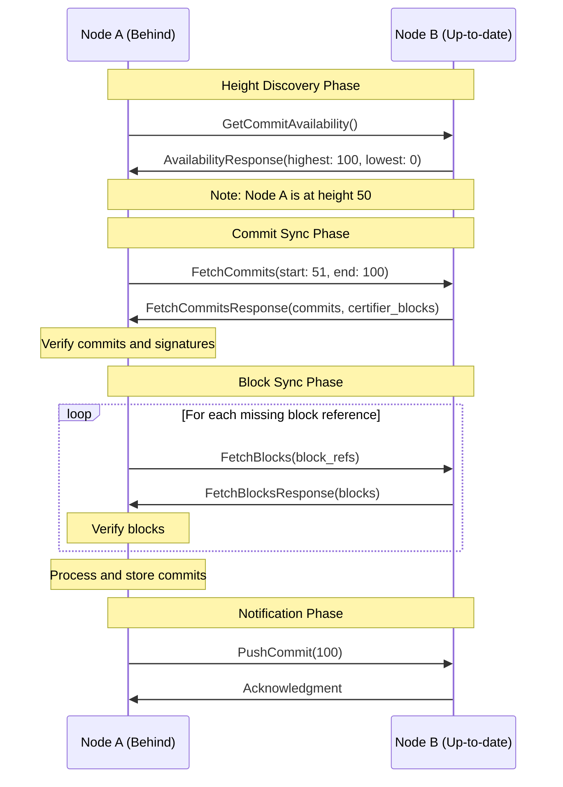

# P2P State Synchronization

## Purpose and Scope
This document explains the state synchronization mechanism in the Soma blockchain's P2P module. It covers how nodes synchronize their state with other nodes in the network, including blocks and commits synchronization, verification processes, and the incremental sync protocol. The document provides a detailed understanding of the implementation, workflow, and security considerations of the state sync subsystem.

## Key Components

### StateSyncEventLoop
- Main event loop for state synchronization
- Monitors peer commit heights
- Orchestrates sync jobs and tasks
- Processes commit events from consensus
- Notifies peers about new commits

### PeerHeights
- Tracks commit heights of peers
- Stores highest known commit indices
- Maintains lowest available commit information
- Used for peer selection during sync

### Sync Process Components
- Block fetching mechanisms
- Commit fetching and verification
- Transaction verification
- Data integrity validation
- Commit processing

## State Sync Protocol



## Sync Workflow

### 1. Height Discovery
The sync process begins by identifying the current state of the network:

1. Node periodically queries connected peers for their highest and lowest available commit indices
2. Each peer responds with its highest synced commit and lowest available commit
3. Node identifies the highest commit across all peers
4. If the highest known commit is greater than the node's highest synced commit, synchronization begins

```rust
async fn query_peer_for_latest_info(
    client: &mut P2pClient<Channel>,
    timeout: Duration,
) -> Option<(CommitIndex, CommitIndex)> {
    let mut request = Request::new(GetCommitAvailabilityRequest {
        timestamp_ms: now_unix(),
    });
    request.set_timeout(timeout);
    let response = client
        .get_commit_availability(request)
        .await
        .map(Response::into_inner);
    match response {
        Ok(GetCommitAvailabilityResponse {
            highest_synced_commit,
            lowest_available_commit,
        }) => {
            return Some((highest_synced_commit, lowest_available_commit));
        }
        Err(_) => {
            return None;
        }
    };
}
```

### 2. Peer Selection
Once a sync is needed, the node selects appropriate peers to sync from:

1. Node creates a `PeerBalancer` to manage peer selection
2. Balancer filters peers based on commit availability
3. Peers are prioritized based on connection quality and random selection
4. Node attempts to sync from the selected peer, falling back to others if needed

### 3. Commit Synchronization
The core sync process focuses on fetching and verifying commits:

1. Node requests commits in batches from the selected peer
2. Peer responds with commits and certifier blocks (blocks containing votes for the commits)
3. Node verifies the commit sequence and integrity
4. Node validates that the last commit has sufficient votes from validators
5. On validation failure, node tries another peer

```rust
async fn fetch_and_verify_commits<S>(
    peer: &PeerState,
    commit_range: RangeInclusive<CommitIndex>,
    store: &S,
    block_verifier: Arc<SignedBlockVerifier>,
    timeout: Duration,
) -> Result<Vec<TrustedCommit>, SomaError>
```

### 4. Block Synchronization
After commits are verified, the node fetches the blocks referenced by those commits:

1. Node collects block references from verified commits
2. Node requests blocks in batches from the selected peer
3. Peer responds with serialized blocks
4. Node verifies each block's integrity and signature
5. Node validates that received blocks match the requested block references

```rust
async fn fetch_blocks_batch(
    peer: &PeerState,
    block_refs: Vec<BlockRef>,
    block_verifier: Arc<SignedBlockVerifier>,
    timeout: Duration,
) -> Result<Vec<VerifiedBlock>, SomaError>
```

### 5. State Application
Once blocks and commits are fetched and verified, the node applies them to its state:

1. Node writes blocks and commits to storage
2. Node processes each commit in sequence
3. Node creates a `CommittedSubDag` representing the commit
4. Node broadcasts the commit to interested components
5. Node updates its highest synced commit index

### 6. Notification
After successful synchronization, the node notifies peers about its new state:

1. Node identifies peers with lower commit heights
2. Node sends `PushCommit` messages to these peers
3. Peers may then initiate their own sync process if needed

## Sync Optimization Techniques

### Batched Fetching
1. Commits fetched in configurable batches to limit network load
2. Blocks fetched in batches with size limits (default 1000 blocks)
3. Response size limited to prevent memory pressure (4MB per response)

### Parallel Processing
1. Block fetch requests pipelined for efficiency
2. Multiple block fetch requests processed concurrently
3. Small delays between requests to avoid overloading target

```rust
// Pipeline the requests to avoid overloading the target.
sleep(Duration::from_millis(200) * i).await;
```

### Incremental Syncing
1. Sync process resumes from node's highest synced commit
2. Partial progress preserved even if sync fails midway
3. Only missing data is requested from peers

### Data Verification
1. Cryptographic verification of all fetched data
2. Chain verification ensures proper sequencing of commits
3. Vote verification ensures commits have sufficient validator support

## Error Handling

### Network Failures
1. Timeouts for all network requests
2. Retry mechanism with different peers on failure
3. Graceful handling of disconnections

### Validation Failures
1. Signature verification failures result in peer switch
2. Sequence validation ensures proper commit chain
3. Mismatched blocks trigger error and retry

### Resource Protection
1. Limits on total data fetched to prevent memory exhaustion
2. Batch size controls to prevent request flooding
3. Backpressure mechanisms in channel communication

## Concurrency Model

### Event Loop Architecture
The state sync system uses an event loop architecture for concurrency:

```rust
pub async fn start(mut self) {
    info!("State-Synchronizer started");

    let mut interval = tokio::time::interval(Duration::from_millis(100));
    
    // Main event loop
    loop {
        tokio::select! {
            now = interval.tick() => {
                self.handle_tick(now.into_std());
            },
            maybe_message = self.mailbox.recv() => {
                if let Some(message) = maybe_message {
                    self.handle_message(message);
                } else {
                    break;
                }
            },
            peer_event = self.peer_event_receiver.recv() => {
                self.handle_peer_event(peer_event);
            },
            Some(task_result) = self.tasks.join_next() => {
                // Handle task result
            },
        }
        
        // Schedule new fetches if needed
        self.maybe_start_sync_task();
        
        sleep(Duration::from_millis(100)).await;
    }
}
```

### Task Management
1. JoinSet for tracking spawned tasks
2. Graceful handling of task completion
3. Error propagation for critical failures
4. Cancellation handling for shutdown scenarios

### State Protection
1. `PeerHeights` protected by `RwLock`
2. Read-heavy operations use read locks
3. Write operations use write locks
4. Careful lock scope management to prevent contention

## Thread Safety Considerations

### Shared State Protection
- `PeerHeights` is protected by `RwLock` for concurrent access
- `PeerHeights` operations are designed to be atomic
- Lock acquisition patterns prevent deadlocks

### Task Coordination
- Tasks spawned with clear ownership boundaries
- Results handled in main event loop to avoid race conditions
- Completion processing ensures consistent state updates

### Channel Communication
- Message passing via channels avoids shared mutable state
- Bounded channels provide backpressure
- Channel closures handled gracefully

## Verification Status

| Component | Verification Status | Confidence | Evidence |
|-----------|---------------------|------------|----------|
| Height Discovery | Verified-Code | 9/10 | Direct inspection of query_peer_for_latest_info implementation |
| Commit Synchronization | Verified-Code | 9/10 | Implementation in fetch_and_verify_commits with clear verification steps |
| Block Fetching | Verified-Code | 9/10 | Complete implementation in fetch_blocks_batch with proper verification |
| State Application | Verified-Code | 9/10 | Implementation in process_verified_commits with proper error handling |
| Peer Selection | Verified-Code | 8/10 | PeerBalancer implementation shows careful peer selection |
| Error Handling | Verified-Code | 8/10 | Comprehensive error handling across sync operations |

## Configuration Parameters

The state sync system is configured with the following parameters:

| Parameter | Default | Description |
|-----------|---------|-------------|
| `mailbox_capacity` | 50 | Capacity of the state sync message mailbox |
| `synced_commit_broadcast_channel_capacity` | 50 | Capacity of the commit event broadcast channel |
| `wait_interval_when_no_peer_to_sync_content` | 1s | Wait interval when no peers are available |
| `timeout` | 30s | Network request timeout |
| `commit_sync_batch_size` | 100 | Maximum commits to sync in a single request |
| `max_blocks_per_fetch` | 1000 | Maximum blocks to request in a single fetch |
| `max_fetch_response_bytes` | 4MB | Maximum bytes in a single fetch response |

## Confidence: 9/10
This document provides a detailed and accurate representation of the state synchronization mechanism based on direct code inspection. The implementation details, workflow, and error handling are accurately represented, with clear evidence from the codebase.

## Last Updated: 2025-03-08 by Cline
