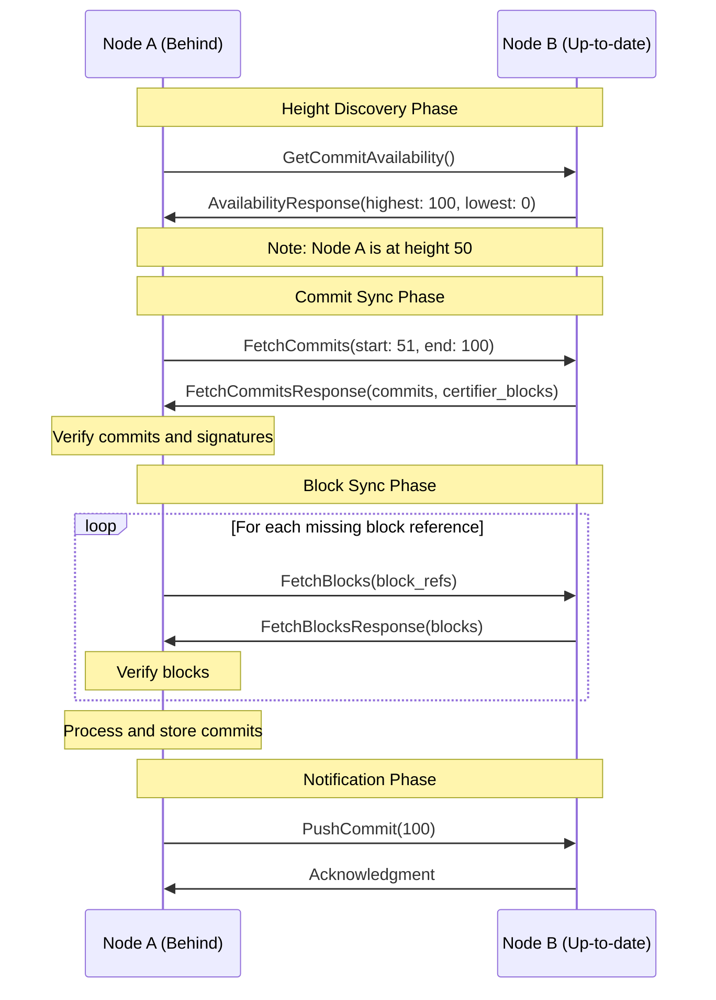

# P2P State Synchronization

## Purpose and Scope
This document explains the state synchronization mechanism in the Soma blockchain's P2P module. It covers how nodes synchronize their state with other nodes in the network, including blocks and commits synchronization, verification processes, and the incremental sync protocol. The document provides a detailed understanding of the implementation, workflow, and security considerations of the state sync subsystem.

## Key Components

### StateSyncEventLoop
- Main event loop for state synchronization
- Monitors peer commit heights
- Orchestrates sync jobs and tasks
- Processes commit events from consensus
- Notifies peers about new commits
- Broadcasts synchronized CommittedSubDag objects

### PeerHeights
- Tracks commit heights of peers
- Stores highest known commit indices
- Maintains lowest available commit information
- Used for peer selection during sync
- Tracks genesis commit digest for chain identification

### PeerBalancer
- Intelligent peer selection mechanism
- Balances sync requests across peers
- Filters peers based on commit availability
- Adds randomization to prevent hotspots
- Selects peers based on ability to serve specific commits

### TxVerifier
- Verifies transactions during sync process
- Validates transaction signatures
- Ensures transaction certificate integrity
- Works with block verifier for complete validation
- Maintains consistent verification standards

### Sync Process Components
- Block fetching mechanisms
- Commit fetching and verification
- Transaction verification
- Data integrity validation
- Commit processing

## State Sync Protocol



## Sync Workflow

### 1. Height Discovery
The sync process begins by identifying the current state of the network:

1. Node periodically queries connected peers for their highest and lowest available commit indices
2. Each peer responds with its highest synced commit and lowest available commit
3. Node identifies the highest commit across all peers
4. If the highest known commit is greater than the node's highest synced commit, synchronization begins

```rust
async fn query_peer_for_latest_info(
    client: &mut P2pClient<Channel>,
    timeout: Duration,
) -> Option<(CommitIndex, CommitIndex)> {
    let mut request = Request::new(GetCommitAvailabilityRequest {
        timestamp_ms: now_unix(),
    });
    request.set_timeout(timeout);
    let response = client
        .get_commit_availability(request)
        .await
        .map(Response::into_inner);
    match response {
        Ok(GetCommitAvailabilityResponse {
            highest_synced_commit,
            lowest_available_commit,
        }) => {
            return Some((highest_synced_commit, lowest_available_commit));
        }
        Err(_) => {
            return None;
        }
    };
}
```

### 2. Peer Selection
Once a sync is needed, the node selects appropriate peers to sync from:

1. Node creates a `PeerBalancer` to manage peer selection
2. Balancer filters peers based on commit availability range
3. Peers are prioritized based on connection quality and random selection
4. Node attempts to sync from the selected peer, falling back to others if needed

```rust
// PeerBalancer is an Iterator that selects peers based on RTT with some added randomness.
struct PeerBalancer {
    peers: VecDeque<(PeerState, PeerStateSyncInfo)>,
    requested_commit: Option<CommitIndex>,
}

impl Iterator for PeerBalancer {
    type Item = PeerState;

    fn next(&mut self) -> Option<Self::Item> {
        while !self.peers.is_empty() {
            const SELECTION_WINDOW: usize = 2;
            let idx = rand::thread_rng().gen_range(0..std::cmp::min(SELECTION_WINDOW, self.peers.len()));
            let (peer, info) = self.peers.remove(idx).unwrap();
            let requested_commit = self.requested_commit.unwrap_or(0);
            if info.height >= requested_commit && info.lowest <= requested_commit {
                return Some(peer);
            }
        }
        None
    }
}
```

### 3. Commit Synchronization
The core sync process focuses on fetching and verifying commits:

1. Node requests commits in batches from the selected peer
2. Peer responds with commits and certifier blocks (blocks containing votes for the commits)
3. Node verifies the commit sequence and integrity
4. Node validates that the last commit has sufficient votes from validators
5. On validation failure, node tries another peer
6. Handles epoch boundaries by truncating commit ranges at epoch transitions

```rust
async fn fetch_and_verify_commits<S>(
    peer: &PeerState,
    commit_range: RangeInclusive<CommitIndex>,
    store: &S,
    block_verifier: Arc<SignedBlockVerifier>,
    timeout: Duration,
) -> Result<Vec<TrustedCommit>, SomaError>
```

### 4. Block Synchronization
After commits are verified, the node fetches the blocks referenced by those commits:

1. Node collects block references from verified commits
2. Node requests blocks in batches from the selected peer
3. Peer responds with serialized blocks
4. Node verifies each block's integrity and signature
5. Node validates that received blocks match the requested block references
6. Enforces size limits on fetch responses (per batch and total)

```rust
async fn fetch_blocks_batch(
    peer: &PeerState,
    block_refs: Vec<BlockRef>,
    block_verifier: Arc<SignedBlockVerifier>,
    timeout: Duration,
) -> Result<Vec<VerifiedBlock>, SomaError>
```

### 5. State Application
Once blocks and commits are fetched and verified, the node applies them to its state:

1. Node writes blocks and commits to storage
2. Node processes each commit in sequence
3. Node creates a `CommittedSubDag` representing the commit
4. Node broadcasts the `CommittedSubDag` to interested components via broadcast channel
5. Node updates its highest synced commit index

### 6. Authority Integration and Transaction Execution
After synchronizing and storing commits, the state sync system integrates with the Authority module for transaction execution:

1. The `CommittedSubDag` objects are broadcast via a channel to the `CommitExecutor` in the authority module
2. The `CommitExecutor` receives these objects and processes them in commit index order
3. For each commit:
   - Transactions are extracted and filtered (removing already executed ones)
   - Shared object versions are assigned as needed
   - Transactions are enqueued to the transaction manager for execution
   - Effects are written to storage
   - Transaction outputs are committed to disk
4. This execution process ensures that all transactions from synchronized commits are properly executed
5. The state accumulator keeps track of the system state for each commit
6. Special handling is provided for end-of-epoch commits, including executing change epoch transactions

### 7. Notification
After successful synchronization, the node notifies peers about its new state:

1. Node identifies peers with lower commit heights
2. Node sends `PushCommit` messages to these peers
3. Peers may then initiate their own sync process if needed

### 8. Epoch Boundary Handling
The sync process has special handling for epoch boundaries:

1. When a commit marks the end of an epoch, sync range is truncated
2. Last commit of epoch is identified by querying the store
3. Commits beyond the epoch boundary are removed from the sync batch
4. The next sync operation will continue with the new epoch

```rust
let last_commit_of_epoch = self
    .store
    .get_last_commit_index_of_epoch(epoch)
    .unwrap_or(inclusive_end);

commits.retain(|c| c.index() <= last_commit_of_epoch);

if last_commit_of_epoch < inclusive_end {
    info!("Truncated commit range to {} due to epoch boundary. Returning {} commits, and {} certifier_blocks", 
          last_commit_of_epoch, commits.len(), certifier_blocks.len());
}
```

## Sync Optimization Techniques

### Batched Fetching
1. Commits fetched in configurable batches to limit network load (default 100 commits)
2. Blocks fetched in batches with size limits (default 1000 blocks per request)
3. Response size limited to prevent memory pressure (4MB per response)
4. Total fetch size limited to 128MB to prevent resource exhaustion

### Parallel Processing
1. Block fetch requests pipelined for efficiency
2. Multiple block fetch requests processed concurrently
3. Small delays between requests to avoid overloading target

```rust
// Pipeline the requests to avoid overloading the target.
sleep(Duration::from_millis(200) * i).await;
```

### Incremental Syncing
1. Sync process resumes from node's highest synced commit
2. Partial progress preserved even if sync fails midway
3. Only missing data is requested from peers
4. Repeat attempts use different peers automatically

### Data Verification
1. Cryptographic verification of all fetched data
2. Chain verification ensures proper sequencing of commits
3. Vote verification ensures commits have sufficient validator support
4. Block verification ensures block integrity and authenticity 
5. Transaction verification in blocks through TxVerifier

## Error Handling

### Network Failures
1. Timeouts for all network requests (default 30s)
2. Retry mechanism with different peers on failure
3. Graceful handling of disconnections
4. Proper error propagation and logging

### Validation Failures
1. Signature verification failures result in peer switch
2. Sequence validation ensures proper commit chain
3. Mismatched blocks trigger error and retry
4. Committee verification for validator signatures

### Resource Protection
1. Limits on total data fetched to prevent memory exhaustion (128MB limit)
2. Batch size controls to prevent request flooding (1000 blocks per request)
3. Backpressure mechanisms in channel communication
4. Response size limits (4MB per response)

## Transaction Verification

The state sync system uses a specialized `TxVerifier` to validate transactions during the sync process:

1. Transactions are extracted from blocks
2. Signatures are verified against the committee
3. Certificate validation ensures proper authority
4. Batch verification optimizes performance

```rust
pub struct TxVerifier {
    signature_verifier: Arc<SignatureVerifier>,
}

impl TransactionVerifier for TxVerifier {
    fn verify_batch(&self, batch: &[&[u8]], epoch: Option<Epoch>) -> Result<(), ValidationError> {
        let txs = batch
            .iter()
            .map(|tx| {
                tx_from_bytes(tx)
                    .map(|tx| tx.kind)
                    .map_err(|e| ValidationError::InvalidTransaction(e.to_string()))
            })
            .collect::<Result<Vec<_>, _>>()?;

        self.validate_transactions(txs, epoch)
            .map_err(|e| ValidationError::InvalidTransaction(e.to_string()))
    }
}
```

## Concurrency Model

### Event Loop Architecture
The state sync system uses an event loop architecture for concurrency:

```rust
pub async fn start(mut self) {
    info!("State-Synchronizer started");

    let mut interval = tokio::time::interval(Duration::from_millis(100));
    
    // Main event loop
    loop {
        tokio::select! {
            now = interval.tick() => {
                self.handle_tick(now.into_std());
            },
            maybe_message = self.mailbox.recv() => {
                if let Some(message) = maybe_message {
                    self.handle_message(message);
                } else {
                    break;
                }
            },
            peer_event = self.peer_event_receiver.recv() => {
                self.handle_peer_event(peer_event);
            },
            Some(task_result) = self.tasks.join_next() => {
                // Handle task result
            },
        }
        
        // Schedule new fetches if needed
        self.maybe_start_sync_task();
        
        sleep(Duration::from_millis(100)).await;
    }
}
```

### Task Management
1. JoinSet for tracking spawned tasks
2. Graceful handling of task completion
3. Error propagation for critical failures
4. Cancellation handling for shutdown scenarios

### State Protection
1. `PeerHeights` protected by `RwLock`
2. Read-heavy operations use read locks
3. Write operations use write locks
4. Careful lock scope management to prevent contention

## Configuration Parameters

The state sync system is configured with the following parameters:

| Parameter | Default | Description |
|-----------|---------|-------------|
| `mailbox_capacity` | 50 | Capacity of the state sync message mailbox |
| `synced_commit_broadcast_channel_capacity` | 50 | Capacity of the commit event broadcast channel |
| `wait_interval_when_no_peer_to_sync_content` | 1s | Wait interval when no peers are available |
| `timeout` | 30s | Network request timeout |
| `commit_sync_batch_size` | 100 | Maximum commits to sync in a single request |
| `max_blocks_per_fetch` | 1000 | Maximum blocks to request in a single fetch |
| `max_fetch_response_bytes` | 4MB | Maximum bytes in a single fetch response |
| `max_total_fetched_bytes` | 128MB | Maximum total bytes to fetch in a complete operation |
| `commit_summary_download_concurrency` | 400 | Number of concurrent download operations |

## Verification Status

| Component | Verification Status | Confidence | Evidence |
|-----------|---------------------|------------|----------|
| Height Discovery | Verified-Code | 9/10 | Direct inspection of query_peer_for_latest_info implementation |
| Commit Synchronization | Verified-Code | 9/10 | Implementation in fetch_and_verify_commits with clear verification steps |
| Block Fetching | Verified-Code | 9/10 | Complete implementation in fetch_blocks_batch with proper verification |
| State Application | Verified-Code | 9/10 | Implementation in process_verified_commits with proper error handling |
| Transaction Verification | Verified-Code | 9/10 | Implementation in TxVerifier with proper signature verification |
| CommitExecutor Integration | Verified-Code | 9/10 | Direct inspection of CommitExecutor receiving CommittedSubDag objects |
| Peer Selection | Verified-Code | 8/10 | PeerBalancer implementation shows careful peer selection |
| Error Handling | Verified-Code | 8/10 | Comprehensive error handling across sync operations |
| Epoch Boundary Handling | Verified-Code | 8/10 | Verified code for handling epoch transitions properly |

## Confidence: 9/10
This document provides a detailed and accurate representation of the state synchronization mechanism based on direct code inspection. The implementation details, workflow, and error handling are accurately represented, with clear evidence from the codebase.

## Last Updated: 2025-03-08 by Cline
