# P2P Thread Safety

## Purpose and Scope
This document explains the thread safety and concurrency control mechanisms in the Soma blockchain's P2P module. It details how the module ensures safe concurrent access to shared data, manages asynchronous tasks, and coordinates between different components. The document provides a comprehensive overview of the locking patterns, channel-based communication, and task management strategies used to ensure reliable operation in a highly concurrent environment.

## Concurrency Model Overview

The P2P module uses a combination of techniques to ensure thread safety:

```mermaid
flowchart TD
    classDef protection fill:#f9f,stroke:#333,stroke-width:2px
    classDef comm fill:#bbf,stroke:#333,stroke-width:1px
    classDef tasks fill:#afa,stroke:#333,stroke-width:1px
    
    RwLock[RwLock Protection]:::protection
    Channels[Channel Communication]:::comm
    TaskMgmt[Task Management]:::tasks
    EventLoop[Event Loop Architecture]:::tasks
    
    RwLock --> DiscoveryState[DiscoveryState]
    RwLock --> PeerHeights[PeerHeights]
    
    Channels --> MessagePassing[Message Passing]
    Channels --> Backpressure[Backpressure]
    Channels --> EventCoord[Event Coordination]
    
    TaskMgmt --> JoinSet[JoinSet]
    TaskMgmt --> ErrorHandling[Error Handling]
    TaskMgmt --> TaskCancellation[Task Cancellation]
    
    EventLoop --> SelectMacro[Tokio Select]
    EventLoop --> SingleAwaitPoint[Single Await Point]
    EventLoop --> EventHandling[Event Handling]
```



## Shared State Protection

### Using RwLock for Shared State

The P2P module extensively uses `RwLock` from the `parking_lot` crate to protect shared state. This provides efficient read-heavy access patterns with multiple concurrent readers but exclusive writers.

#### DiscoveryState Protection

```rust
pub struct DiscoveryState {
    pub our_info: Option<SignedNodeInfo>,
    pub known_peers: HashMap<PeerId, VerifiedSignedNodeInfo>,
}

// Protected with RwLock
pub state: Arc<RwLock<DiscoveryState>>
```

**Access Patterns:**
- **Read Access**: Multiple concurrent readers can access `our_info` and `known_peers` simultaneously
- **Write Access**: Single exclusive writer for updates to node information and peer list
- **Lock Acquisition**: Explicit `.read()` and `.write()` methods with clear scope

**Thread Safety Considerations:**
- Read locks are used for:
  - Retrieving local node information
  - Consulting known peers list
  - Checking connection status
- Write locks are used for:
  - Updating node information timestamps
  - Adding new peers to known peers list
  - Removing disconnected peers

#### PeerHeights Protection

```rust
pub struct PeerHeights {
    /// Table used to track the highest commit for each of our peers.
    peers: HashMap<PeerId, PeerStateSyncInfo>,
    // Wait interval configuration
    wait_interval_when_no_peer_to_sync_content: Duration,
}

// Protected with RwLock
pub peer_heights: Arc<RwLock<PeerHeights>>
```

**Access Patterns:**
- **Read Access**: Multiple components can concurrently check peer heights
- **Write Access**: Single writer when updating peer commit information
- **Lock Scope**: Lock acquisition limited to the minimum scope needed

**Thread Safety Considerations:**
- Read locks are used for:
  - Finding the highest known commit
  - Selecting peers for synchronization
  - Checking if sync is needed
- Write locks are used for:
  - Updating a peer's commit height information
  - Adding new peers to the tracking map
  - Removing peers that have disconnected

### Lock Acquisition Patterns

The P2P module follows these lock acquisition patterns to prevent deadlocks:

1. **Hierarchy Adherence**: Locks are acquired in a consistent order
2. **Minimal Scope**: Locks are held for the shortest duration possible
3. **No Nested Locks**: Avoiding acquiring locks while already holding another lock
4. **Clear Ownership**: Each shared state has clear ownership boundaries

Example from discovery module:

```rust
// Reading with minimal scope
let state = self.state.read();
let eligible = state
    .known_peers
    .iter()
    .filter(|(peer_id, info)| {
        !self.pending_dials.contains_key(peer_id)
    })
    .map(|(k, v)| (*k, v.clone()))
    .collect::<Vec<_>>();

// Drop lock before processing result
drop(state);

// Process eligible peers without holding the lock
for (peer_id, info) in eligible.iter() {
    // ...
}
```

## Channel-Based Communication

The P2P module uses Tokio channels extensively for thread-safe communication between components:

### Channel Types and Usage

1. **mpsc (Multi-producer, single-consumer) Channels**:
   - **StateSyncMessage channel**: For sending sync commands to state sync loop
   - **ChannelManagerRequest channel**: For peer connection requests
   - **SignedNodeInfo channel**: For discovery information sharing

2. **broadcast Channels**:
   - **CommittedSubDag channel**: For broadcasting commit events
   - **PeerEvent channel**: For broadcasting peer connect/disconnect events

3. **oneshot Channels**:
   - **Response channels**: For synchronous request-response patterns
   - **Shutdown signal channels**: For clean shutdown coordination

### Channel Boundaries and Ownership

Each component has clear channel ownership:

- **DiscoveryEventLoop**: Owns discovery-related channels
- **StateSyncEventLoop**: Owns sync-related channels
- **P2pService**: Has sending endpoints to both loops

### Backpressure Handling

Channels use bounded capacity to provide backpressure:

```rust
// Creating bounded channels with configured capacity
let (state_sync_sender, mailbox) = mpsc::channel(state_sync_config.mailbox_capacity());
let (commit_event_sender, _receiver) = broadcast::channel(
    state_sync_config.synced_commit_broadcast_channel_capacity() as usize,
);
```

Backpressure is handled through:
1. **Bounded Queues**: Fixed capacity prevents unbounded memory growth
2. **Send Pattern**: `.try_send()` allows immediate handling of full channels
3. **Graceful Degradation**: Non-critical messages can be dropped when backpressured

### Error Handling for Channels

The code handles channel errors explicitly:

```rust
// Send with error handling
if let Err(e) = self.discovery_sender.try_send(their_info.clone()) {
    debug!("Failed to send their info to connect back: {}", e);
} else {
    info!("Sent their info to connect back: {}", their_info.peer_id);
}

// Receive with error handling
match rx.await {
    Ok(Ok(_)) => return,
    Ok(Err(e)) => {
        debug!(
            "error connecting to {} at address '{}': {e}",
            info.peer_id.short_display(4),
            info.address
        );
    }
    Err(e) => {
        debug!("connect request cancelled: {e}");
    }
}
```

## Task Management

The P2P module uses Tokio tasks for concurrent operations with a structured management approach:

### JoinSet-Based Task Tracking

Both major event loops use `JoinSet` to track spawned tasks:

```rust
pub struct StateSyncEventLoop<S> {
    // Other fields...
    tasks: JoinSet<()>,
    // Other fields...
}

pub struct DiscoveryEventLoop {
    // Other fields...
    tasks: JoinSet<()>,
    // Other fields...
}
```

Tasks are spawned with clear boundaries:

```rust
// Spawning task into JoinSet
self.tasks.spawn(query_connected_peers_for_their_known_peers(
    self.active_peers.clone(),
    self.discovery_config.clone(),
    self.state.clone(),
    self.allowlisted_peers.clone(),
));
```

### Error Handling in Tasks

Task results are handled with comprehensive error management:

```rust
Some(task_result) = self.tasks.join_next() => {
    match task_result {
        Ok(()) => {},
        Err(e) => {
            if e.is_cancelled() {
                // avoid crashing on ungraceful shutdown
            } else if e.is_panic() {
                // propagate panics.
                std::panic::resume_unwind(e.into_panic());
            } else {
                panic!("task failed: {e}");
            }
        },
    };
},
```

### Task Cancellation and Cleanup

The module implements proper task cancellation:

1. **Tracking Task Handles**: AbortHandle used for explicit cancellation
2. **Cleanup on Exit**: All tasks are joined during shutdown
3. **Panic Propagation**: Critical failures correctly propagated

```rust
// Cleaning up completed tasks
self.pending_dials.retain(|_k, v| !v.is_finished());
if let Some(abort_handle) = &self.dial_seed_peers_task {
    if abort_handle.is_finished() {
        self.dial_seed_peers_task = None;
    }
}
```

## Event Loop Architecture

The P2P module uses event loop architecture for concurrency control:

### Single Await Point Pattern

Both `DiscoveryEventLoop` and `StateSyncEventLoop` use a single await point pattern:

```rust
loop {
    tokio::select! {
        now = interval.tick() => {
            self.handle_tick(now.into_std());
        },
        maybe_message = self.mailbox.recv() => {
            if let Some(message) = maybe_message {
                self.handle_message(message);
            } else {
                break;
            }
        },
        peer_event = self.peer_event_receiver.recv() => {
            self.handle_peer_event(peer_event);
        },
        Some(task_result) = self.tasks.join_next() => {
            // Handle task result...
        },
    }
}
```

This pattern ensures:
1. **Single Thread Execution**: Event handlers run on the same thread
2. **No Race Conditions**: No concurrent mutation of loop-owned state
3. **Event Prioritization**: Events are handled in arrival order

### Non-Blocking Event Handlers

Event handlers are designed to be non-blocking:

```rust
// Non-blocking event handler
fn handle_message(&mut self, message: StateSyncMessage) {
    debug!("Received message: {:?}", message);
    match message {
        StateSyncMessage::StartSyncJob => self.maybe_start_sync_task(),
        StateSyncMessage::VerifiedCommit(commit) => self.handle_commit_from_consensus(commit),
        StateSyncMessage::SyncedCommit(commit) => self.spawn_notify_peers_of_commit(commit),
    }
}
```

This ensures:
1. **Responsiveness**: Main loop remains responsive to new events
2. **Fairness**: No event handler can starve others
3. **Predictability**: Event processing has bounded time complexity

### Task Spawning for Long Operations

Long-running operations are offloaded to separate tasks:

```rust
fn spawn_notify_peers_of_commit(&mut self, commit: CommitIndex) {
    let task = notify_peers_of_commit(
        self.active_peers.clone(),
        self.peer_heights.clone(),
        commit,
        self.config.timeout(),
    );
    self.tasks.spawn(task);
}
```

This prevents blocking the event loop while still maintaining clear ownership.

## Memory Safety Considerations

The P2P module ensures memory safety through several mechanisms:

### Arc for Shared Ownership

`Arc` is used for shared ownership of data:

```rust
// Shared ownership of common data
pub discovery_state: Arc<RwLock<DiscoveryState>>,
pub peer_heights: Arc<RwLock<PeerHeights>>,
pub block_verifier: Arc<SignedBlockVerifier>,
```

This ensures:
1. **Clear Ownership**: Data has well-defined ownership
2. **Safe Sharing**: Multiple components can safely access the same data
3. **Lifetime Management**: Data lives as long as needed without manual tracking

### Clone for Value Semantics

The code uses `clone()` where appropriate to provide value semantics:

```rust
// Cloning for value semantics
let own_info = state
    .read()
    .our_info
    .clone()
    .expect("Our info should be set");
```

This ensures:
1. **Ownership Transfer**: Clear transfer of ownership
2. **Preventing Borrow Conflicts**: Avoid borrow checker conflicts
3. **Lock Scope Reduction**: Reduce lock durations

### Bounded Resource Use

The code ensures bounded resource use:

1. **Bounded Channels**: All channels have configured capacity
2. **Request Limits**: Network requests have limits (MAX_FETCH_RESPONSE_BYTES)
3. **Collection Limits**: Collection sizes are bounded (MAX_PEERS_TO_SEND)

## Verification Status

| Component | Verification Status | Confidence | Evidence |
|-----------|---------------------|------------|----------|
| RwLock Protection | Verified-Code | 9/10 | Direct inspection of locking patterns in StateSyncEventLoop and DiscoveryEventLoop |
| Channel Communication | Verified-Code | 9/10 | Consistent channel usage across module with proper error handling |
| Task Management | Verified-Code | 9/10 | JoinSet usage and proper error handling in both event loops |
| Event Loop Architecture | Verified-Code | 9/10 | Single await point pattern consistently followed |
| Memory Safety | Verified-Code | 9/10 | Consistent Arc/Clone usage with clear ownership boundaries |

## Confidence: 9/10
This document provides a comprehensive and accurate representation of the thread safety mechanisms in the P2P module based on direct code inspection. The concurrency patterns, locking strategies, and channel-based communication are accurately represented with clear evidence from the codebase.

## Last Updated: 2025-03-08 by Cline
