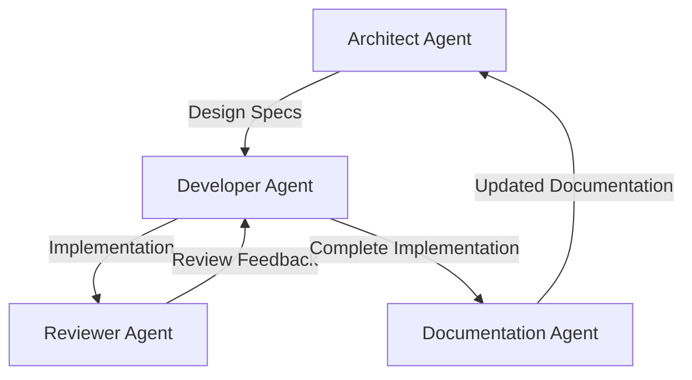

# Agent Collaboration Workflows

## Purpose and Scope
This document describes the workflows and practices for AI agent collaboration on the Soma blockchain project. It explains how different agent roles interact, how to manage context transitions between agents, and provides guidance for effective multi-agent development.

## Agent Roles

### Architect Agent
- **Primary Focus**: System design and architecture
- **Responsibilities**:
  - Design system components with clear interfaces
  - Create detailed implementation plans
  - Evaluate architectural trade-offs
  - Define system patterns and best practices
  - Rate confidence in designs (1-10)
- **Memory Bank Usage**:
  - Heavy focus on systemPatterns.md
  - Updates core architectural documents
  - Creates design specifications

### Developer Agent
- **Primary Focus**: Implementation and testing
- **Responsibilities**:
  - Implement according to architectural plans
  - Write comprehensive tests
  - Implement proper error handling and async patterns
  - Update implementation documentation
  - Rate confidence in implementation (1-10)
- **Memory Bank Usage**:
  - References module-specific documents
  - Updates active task documents
  - Documents implementation details

### Reviewer Agent
- **Primary Focus**: Code quality and security
- **Responsibilities**:
  - Verify code against requirements
  - Check for security vulnerabilities
  - Validate coding standards
  - Provide improvement recommendations
  - Rate code quality (1-10)
- **Memory Bank Usage**:
  - Updates stability_checklist.md
  - Adds security considerations to documents
  - Reviews confidence ratings

### Documentation Agent
- **Primary Focus**: Knowledge capture and organization
- **Responsibilities**:
  - Update Memory Bank documents
  - Create user and developer documentation
  - Organize patterns and learnings
  - Maintain glossary and references
  - Rate documentation completeness (1-10)
- **Memory Bank Usage**:
  - Updates all relevant Memory Bank files
  - Maintains documentation_progress.md
  - Ensures consistent terminology

## Agent Workflows



### Design and Planning Workflow
1. Architect Agent reviews current Memory Bank state
2. Architect designs component architecture
3. Architect updates systemPatterns.md with new patterns
4. Architect creates design specification
5. Architect sets confidence rating and hands off to Developer

### Implementation Workflow
1. Developer Agent reviews design specification
2. Developer implements according to design
3. Developer writes comprehensive tests
4. Developer updates module documentation
5. Developer sets confidence rating and hands off to Reviewer

### Review Workflow
1. Reviewer Agent reviews implementation
2. Reviewer verifies against requirements
3. Reviewer checks for security issues
4. Reviewer provides feedback or approval
5. Reviewer hands off back to Developer (if issues) or to Documentation Agent

### Documentation Workflow
1. Documentation Agent reviews implementation
2. Documentation updates Memory Bank documents
3. Documentation ensures consistent terminology
4. Documentation verifies cross-references
5. Documentation sets confidence rating and hands off for next task

## Agent Transition Protocol

### From Agent A to Agent B
1. Agent A completes current task milestone
2. Agent A updates Memory Bank documents:
   - Updates active/current_tasks.md
   - Updates module-specific documentation
   - Rates confidence in completed work
3. Agent A creates transition notes:
   - Current status summary
   - Known issues or concerns
   - Files modified or created
   - Next steps for Agent B
4. Agent B begins by:
   - Reading transition notes
   - Reviewing updated Memory Bank documents
   - Understanding current task context
   - Identifying immediate next steps

### Example Transition Note Format
```
# Transition: Architect → Developer

## Task Status
- Designed transaction validation component
- Created detailed interface specifications
- Identified integration points with existing components
- Confidence: 8/10

## Modified Documents
- memory-bank/modules/authority.md
- memory-bank/active/current_tasks.md

## Known Issues
- Edge case handling for shared objects needs verification
- Performance testing framework not yet in place

## Next Steps
1. Implement TransactionValidator according to spec
2. Write unit tests for all validation paths
3. Integrate with AuthorityState
4. Update documentation with implementation details
```

## Context Preservation Strategies

### Memory Bank First Approach
- Prioritize Memory Bank updates before transitions
- Ensure all context is captured in documents
- Don't rely on direct agent-to-agent handoffs
- Use confidence ratings to indicate completeness

### Document-Driven Development
- Treat Memory Bank as source of truth
- Update documentation before implementation
- Verify implementation against documentation
- Use documentation for reviews and validation

### Explicit Context Boundaries
- Clearly define task scope in current_tasks.md
- Document assumptions and dependencies
- List known limitations and future work
- Provide explicit next steps for next agent

## Best Practices for Agent Collaboration

### Memory Bank Maintenance
- Always update Memory Bank first
- Document confidence with 1-10 ratings
- Add detailed reasoning for design decisions
- Include examples for complex concepts

### Agent Communication
- Use structured transition notes
- Be explicit about next steps
- Document all decisions and rationales
- Leave clear "threads" for other agents to pick up

### Task Coordination
- Break work into discrete, independently verifiable tasks
- Set clear completion criteria
- Define entry and exit points for each agent
- Document dependencies between tasks

### Knowledge Transfer
- Explain why, not just what
- Document edge cases and failure modes
- Include performance considerations
- Capture learning and insights

## Common Collaboration Patterns

### Architect-Developer Pairing
- Architect creates design specification
- Developer implements based on specification
- Developer provides feedback on design feasibility
- Architect adjusts design based on implementation feedback

### Developer-Reviewer Cycle
- Developer implements feature
- Reviewer evaluates implementation
- Developer addresses review feedback
- Repeat until quality thresholds met

### Multi-Agent Task Force
- Multiple agents work on different aspects of a complex feature
- Regular synchronization through Memory Bank updates
- Clear division of responsibilities
- Structured integration points

## Confidence: 7/10
This document provides a good foundation for agent collaboration workflows but will evolve as we gain more experience with multi-agent development on the Soma blockchain project.

## Last Updated: 2025-03-08 by Cline
