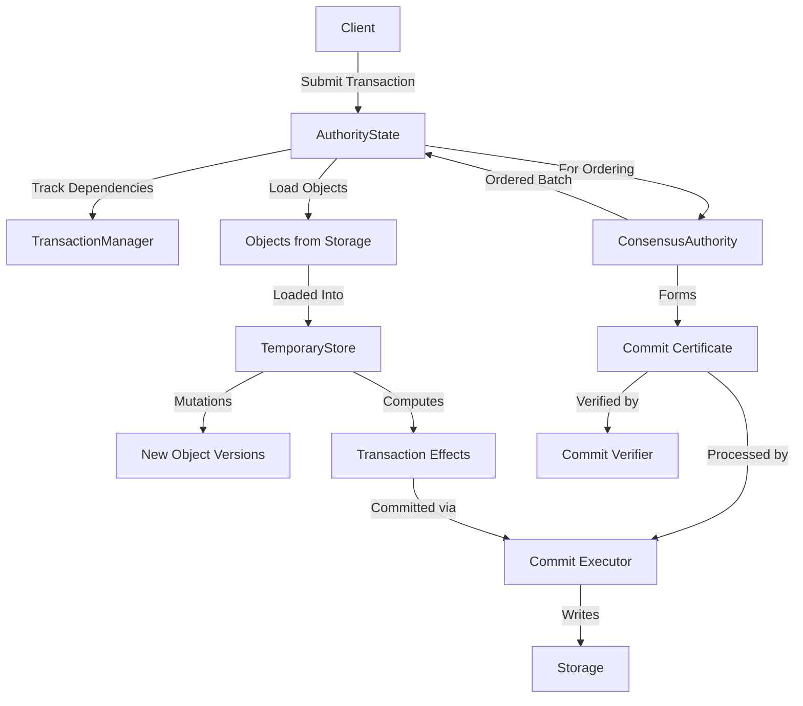
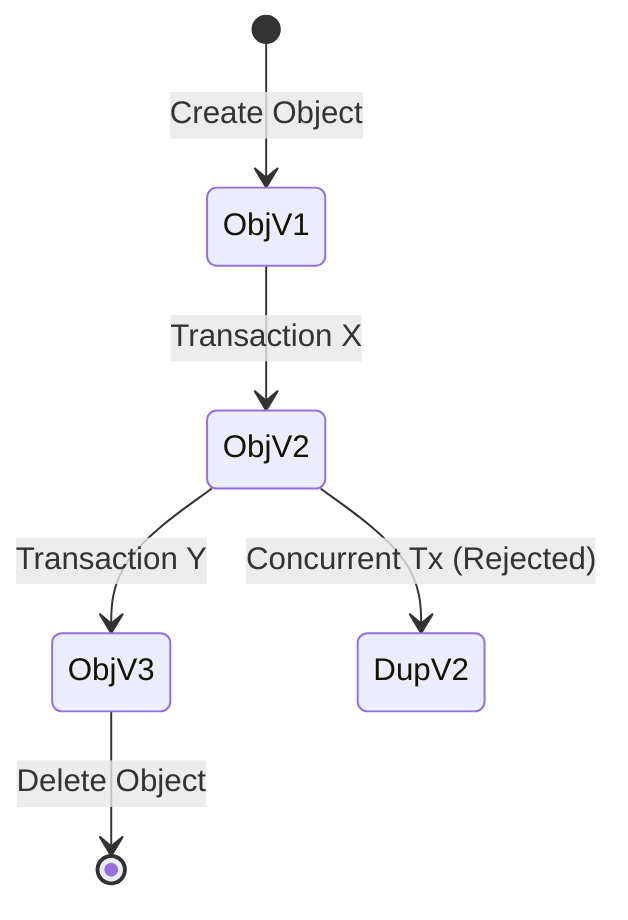
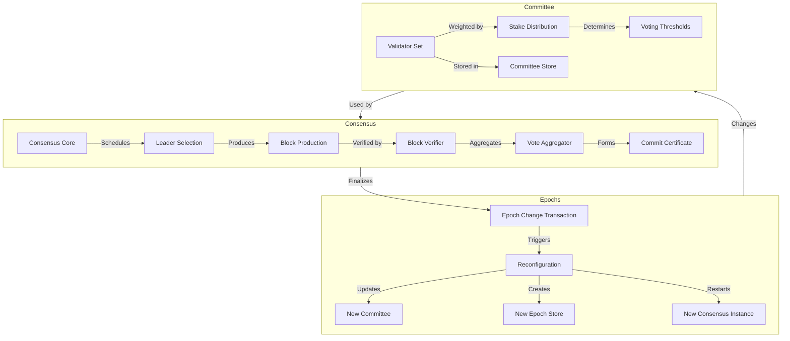
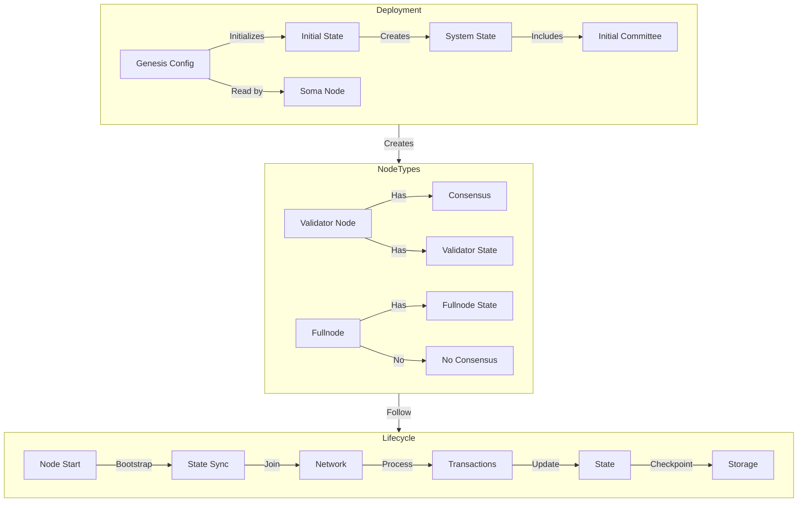

# Cross-File Documentation Suggestions

This document provides practical suggestions and examples for implementing cross-file documentation in the Soma blockchain codebase. It serves as a complementary resource to the overall documentation strategy.

## Optimized Documentation Pillars

The documentation strategy has been optimized to focus on three core pillars that provide maximum understanding with minimum documentation overhead:

### 1. Core Data Flow
- Combines transaction lifecycle, object model/ownership, and commit processing
- Focuses on the complete data path through the system
- Primary concern for developers implementing features or fixes

### 2. System Coordination 
- Combines consensus workflow, validator committee, and epoch reconfiguration
- Explains how the system maintains agreement and evolves over time
- Critical for understanding BFT properties and system governance

### 3. Deployment & Operations
- Combines node types (fullnode vs. validator), genesis/bootstrap, and node lifecycle
- Focuses on how the system is deployed and maintained
- Essential for operators and SREs managing the network

## Pillar 1: Core Data Flow Documentation Example

```markdown
# Core Data Flow in Soma Blockchain

## Purpose and Scope
This document explains the complete flow of data through the Soma blockchain, from transaction submission to state changes. It covers the transaction lifecycle, object model and ownership system, and commit processing - the three fundamental aspects of how data moves through the system.

## Key Components
- **AuthorityState** (authority/src/state.rs): Central state management
- **TransactionManager** (authority/src/tx_manager.rs): Manages transaction dependencies and scheduling
- **TemporaryStore** (types/src/temporary_store.rs): Handles in-memory object mutations 
- **Object** (types/src/object.rs): Core data structure representing blockchain state
- **ConsensusAuthority** (consensus/src/authority.rs): Orders transactions
- **CommitExecutor** (authority/src/commit/executor.rs): Processes transaction commits

## Component Relationships Diagram



## 1. Transaction Lifecycle

### Submission and Validation
- Step 1: Client creates signed transaction with input objects and operations
- Step 2: Transaction submitted to AuthorityState.handle_transaction()
- Step 3: TransactionManager checks object availability and dependencies
- Step 4: Transaction validated (signatures, ownership, input objects)
- Step 5: Valid transaction submitted to ConsensusAuthority

### Ordering and Execution
- Step 1: ConsensusAuthority includes transaction in block proposal
- Step 2: Validators reach consensus on transaction order
- Step 3: Consensus forms commit certificate with ordered transactions
- Step 4: AuthorityState loads input objects into TemporaryStore
- Step 5: Transaction executed against TemporaryStore
- Step 6: Effects (created/modified/deleted objects) computed

### Commit Processing
- Step 1: CommitExecutor receives commit certificate with ordered transactions
- Step 2: Commit certificate signatures verified against validator committee
- Step 3: Transaction effects applied to permanent storage
- Step 4: State updated and dependencies in TransactionManager resolved
- Step 5: Notifications sent to waiting clients and other components

## 2. Object Model and Ownership

### Object Structure
- **Identity**: Unique ID + version for each object instance
- **Ownership**: Owner address, shared, or immutable status
- **Content**: Actual data payload (Move object or system object)
- **Metadata**: Creation time, previous transactions, etc.

### Ownership Types
- **Exclusive Ownership**: Object owned by a single address
  - Accessed/modified only by owner's transactions
  - Sequential versioning for linearizability
- **Shared Ownership**: Accessible by multiple addresses
  - Consensus-protected access control
  - Versioned by consensus round
- **Immutable Objects**: Cannot be modified after creation
  - Referenced freely in any transaction
  - No ownership transfer or versioning needed

### Object Versioning



### Object Lifecycle Events
1. **Creation**: New objects created via transaction execution
2. **Mutation**: Object state changed, new version created
3. **Ownership Transfer**: Owner field updated, new version created
4. **Deletion**: Object marked as deleted in transaction effects
5. **Reference**: Objects referenced without modification (no version change)

## 3. Commit Processing

### Commit Certificate Structure
- Transaction batch (ordered list of transaction digests)
- Round number and other metadata
- Threshold signature from validator committee

### Commit Verification Process
- Step 1: Verify threshold signature against known committee
- Step 2: Check that round number is valid for current epoch
- Step 3: Validate causal history (all parent certificates exist)
- Step 4: Check for conflicting certificates at same round

### Commit Execution
- Step 1: Acquire write lock on authority state
- Step 2: Process each transaction's effects in order
- Step 3: Write new object versions to storage
- Step 4: Update indices and checkpoints
- Step 5: Release locks and notify dependencies

### Commit Synchronization
- Step 1: Identify missing commits on other validators
- Step 2: Pull missing commits in causal order
- Step 3: Verify and execute missing commits
- Step 4: Update local state to match

## Thread Safety Considerations
- **AuthorityState**: RwLock for concurrent read access
- **TransactionManager**: Per-object locks for concurrent processing
- **TemporaryStore**: Single-threaded during transaction execution
- **CommitExecutor**: Sequential processing with exclusive locks
- **Object Cache**: Concurrent reads with atomic reference updates

## Error Handling Across Components
- **Input Object Errors**: Detected in validation, transaction rejected
- **Execution Errors**: Recorded in effects, transaction still committed
- **Consensus Errors**: May require view change or epoch reconfiguration
- **Commit Errors**: System may halt or recover depending on error type

## Configuration Parameters
- **max_concurrent_transactions**: Controls TransactionManager parallelism
- **execution_timeout_ms**: Maximum time for transaction execution
- **object_cache_size**: Affects object retrieval performance
- **commit_batch_size**: Impacts commit processing throughput

## Evolution History
- Originally used synchronous execution with single-object transactions
- Added multi-object transactions with static dependency checking
- Implemented dynamic dependency tracking for higher concurrency
- Separated validation and execution phases for throughput improvements
- Added object versioning with causal consistency
```

## Pillar 2: System Coordination Documentation Example

```markdown
# System Coordination in Soma Blockchain

## Purpose and Scope
This document explains how the Soma blockchain coordinates activities across validators, including the consensus protocol, validator committee management, and epoch reconfigurations. These mechanisms enable Byzantine fault tolerance, agreement on transaction ordering, and evolution of the validator set over time.

## Key Components
- **ConsensusAuthority** (consensus/src/authority.rs): Main consensus engine
- **Core** (consensus/src/core.rs): Consensus state machine
- **Committee** (types/src/committee.rs): Validator set and stake distribution
- **CommitteeStore** (types/src/committee.rs): Committee management across epochs
- **ThresholdClock** (consensus/src/threshold_clock.rs): Round management
- **AuthorityState** (authority/src/state.rs): Authority state manager
- **Reconfiguration** (authority/src/reconfiguration.rs): Epoch change handler

## Component Relationships Diagram



## 1. Consensus Workflow

### Leader Selection and Block Production
- Step 1: ThresholdClock advances round based on time and/or votes
- Step 2: LeaderSchedule selects validator for current round (stake-weighted selection)
- Step 3: Leader collects pending transactions and builds block
- Step 4: Leader signs and broadcasts block to other validators
- Step 5: Validators receive and buffer the block for processing

### Block Verification and Voting
- Step 1: Validators verify block validity (signature, parent hash, etc.)
- Step 2: Validators check all transactions in block are valid
- Step 3: If valid, validators sign and broadcast votes for the block
- Step 4: Each validator collects votes from other validators
- Step 5: Once voting threshold reached, form commit certificate

### Commit Processing and Round Advancement
- Step 1: Validators broadcast commit certificate to network
- Step 2: Upon receiving certificate, process all transactions in the block
- Step 3: Update state based on transaction effects
- Step 4: Advance to next consensus round
- Step 5: Check for timeout and trigger view change if needed

## 2. Validator Committee Management

### Committee Structure
- **Validator Set**: Collection of validator public keys and metadata
- **Stake Weights**: Amount of stake controlled by each validator
- **Voting Thresholds**: Quorum and decision thresholds (typically 2f+1)
- **Epoch ID**: Monotonically increasing epoch identifier

### Committee-Based Operations
- **Voting**: Validators vote on blocks, weighted by stake
- **Threshold Signatures**: Aggregate signatures from committee members
- **Leader Selection**: Probability proportional to stake weight
- **Slashing**: Penalties for protocol violations

### Committee Rotation
- Step 1: System determines next epoch's committee composition
- Step 2: Epoch change transaction includes new validator set
- Step 3: Transaction executed and new committee activated
- Step 4: CommitteeStore updated with new committee data
- Step 5: All components notified of committee change

## 3. Epoch Reconfiguration

### Epoch Boundary Detection
- Step 1: Special system transaction marks epoch boundary
- Step 2: Transaction executed as part of normal consensus
- Step 3: Reconfiguration logic triggered by transaction effects
- Step 4: All validators agree on exact epoch change point

### Epoch Storage Transition
- Step 1: AuthorityState creates new AuthorityPerEpochStore
- Step 2: CommitteeStore updated with new committee
- Step 3: ArcSwap atomically replaces active epoch store
- Step 4: Old epoch data preserved for historical queries

### Component Reconfiguration
- Step 1: ConsensusAuthority gracefully shut down
- Step 2: New ConsensusAuthority instance created with new committee
- Step 3: P2P connections updated based on new validator set
- Step 4: System resumes with new epoch configuration

## Thread Safety During Coordination
- **Reconfiguration Lock**: Prevents concurrent reconfiguration attempts
- **Consensus Thread Isolation**: Core consensus runs in dedicated thread
- **Committee Immutability**: Committee objects are immutable once created
- **Atomic Store Swap**: Epoch store replaced atomically with ArcSwap

## Error Handling
- **Leader Failure**: Timeout mechanism triggers view change protocol
- **Forking**: Safety violation detection and alerting
- **Reconfiguration Failure**: Recovery procedures with retry logic
- **Network Partitions**: Consensus halts until quorum restored

## Coordination Parameters
- **epoch_duration**: Time or blocks between epoch changes
- **min_validators**: Minimum validators required for operations
- **voting_timeout_ms**: Timeout before round change
- **reconfiguration_timeout_ms**: Maximum time for reconfiguration
```

## Pillar 3: Deployment & Operations Documentation Example

```markdown
# Deployment & Operations in Soma Blockchain

## Purpose and Scope
This document explains the operational aspects of the Soma blockchain, including the differences between fullnodes and validators, the genesis and bootstrap process, and the lifecycle of a node. It provides essential information for deploying, operating, and maintaining a Soma blockchain network.

## Key Components
- **SomaNode** (node/src/lib.rs): Main node implementation
- **AuthorityState** (authority/src/state.rs): Core state management
- **Genesis** (types/src/genesis.rs): Genesis configuration
- **P2P** (p2p/src/builder.rs): Network infrastructure
- **SystemState** (types/src/system_state.rs): Core system objects

## Component Relationships Diagram



## 1. Fullnodes vs. Validators

### Role Differences
- **Validators**: Participate in consensus, produce and verify blocks
- **Fullnodes**: Execute transactions, serve queries, don't participate in consensus

### Architectural Differences

| Feature | Validator | Fullnode |
|---------|-----------|----------|
| Consensus | Active participant | Observer only |
| Keys | Validator key + network key | Network key only |
| Storage | Full state | Full state |
| Transaction processing | Validate + execute | Execute only |
| P2P role | Authority + peer | Peer only |

### Behavioral Differences
- **Transaction Processing**:
  - Validators: Validate, order, and execute transactions
  - Fullnodes: Execute transactions after validation by validators

- **State Synchronization**:
  - Validators: Provide state to peers, sync from other validators
  - Fullnodes: Only sync state from validators, don't provide state

- **Configuration Differences**:
  - Validators: Configure consensus parameters and authority keys
  - Fullnodes: Minimal configuration, primarily network and storage

## 2. Genesis and Bootstrap

### Genesis Configuration
- **validators**: Initial validator set with public keys and stake
- **committees**: Committee configuration for epoch 0
- **network_parameters**: P2P network configuration
- **protocol_version**: Initial protocol version
- **timestamp**: Genesis timestamp

### Genesis Creation Process
- Step 1: Define initial validator set and parameters
- Step 2: Generate genesis configuration file
- Step 3: Create initial system objects
- Step 4: Distribute genesis file to initial validators
- Step 5: Validators initialize with genesis file

### Node Bootstrap Process
- Step 1: Node reads genesis configuration
- Step 2: Initializes storage with genesis objects
- Step 3: Connects to seed nodes from configuration
- Step 4: Discovers peer nodes via P2P discovery
- Step 5: Synchronizes state from validated checkpoint

### Bootstrap Security
- Genesis hash verification prevents alternative genesis attacks
- Certificate chain validation from genesis committee
- Stake threshold required for bootstrap security
- DNS seeding with fallback mechanisms

## 3. Node Lifecycle

### Startup Sequence
- Step 1: Load configuration and connect to database
- Step 2: Initialize components (AuthorityState, storage, networking)
- Step 3: For validators, initialize consensus engine
- Step 4: Start P2P networking and service registration
- Step 5: Begin transaction processing and/or consensus

### Normal Operation
- Transaction processing and execution
- State synchronization with peers
- Object garbage collection and pruning
- Metrics collection and reporting
- Checkpoint creation

### Epoch Transition
- Detect epoch boundary via system transaction
- Reconfigure with new validator set
- Restart consensus with new committee
- Update networking connections
- Archive old epoch data

### Graceful Shutdown
- Stop accepting new transactions
- Complete pending transaction processing
- Flush state to persistent storage
- Create clean checkpoint
- Terminate connections and services

## Key Operational Parameters
- **db_path**: Location of RocksDB storage
- **network_address**: P2P network binding
- **validator_mode**: Boolean to enable validator functionality
- **checkpoint_frequency**: How often to create state checkpoints
- **sync_retry_interval**: Backoff for sync failures
- **state_pruning_config**: Settings for state pruning

## Monitoring and Maintenance
- Key metrics for validator health
- Common error conditions and recovery procedures
- Update and upgrade process
- Data backup and recovery
- Security best practices

## Deployment Considerations
- Hardware requirements for validators vs. fullnodes
- Network configuration for optimal performance
- Security considerations for validator keys
- Database sizing and growth projections
- High availability configuration options
```

## Implementation Guidelines

When implementing the three-pillar documentation approach:

### 1. Core Data Flow Documentation

Focus on these critical elements:
- Complete end-to-end transaction flow
- Object model and ownership rules
- Commit formation, verification, and execution
- Cross-component interactions for data processing
- Error handling across the data path

Start with:
1. Document authority/src/tx_manager.rs (completed)
2. Document authority/src/tx_validator.rs
3. Document authority/src/commit/executor.rs
4. Create the Core Data Flow cross-file document

### 2. System Coordination Documentation

Emphasize these aspects:
- Consensus protocol and BFT properties
- Committee formation and stake-weighted voting
- Epoch boundary detection and transition process
- Component reconfiguration during epoch changes
- Safety and liveness guarantees

Start with:
1. Document consensus/src/authority.rs
2. Document consensus/src/core.rs 
3. Document authority/src/reconfiguration.rs
4. Create the System Coordination cross-file document

### 3. Deployment & Operations Documentation

Highlight these operational concerns:
- Node type differences and configuration
- Genesis file format and bootstrap sequence
- Node lifecycle management
- State synchronization between nodes
- Operational monitoring and maintenance

Start with:
1. Document node/src/lib.rs
2. Document p2p/src/discovery/mod.rs
3. Document p2p/src/state_sync/mod.rs
4. Create the Deployment & Operations cross-file document

## Using Mermaid Diagrams Effectively

Each pillar document should include:

1. **Component Relationships**: Showing how components interact
   ```mermaid
   flowchart TD
       A[Component A] -->|action| B[Component B]
   ```

2. **Sequence Diagrams**: Showing process flows
   ```mermaid
   sequenceDiagram
       Component1->>Component2: Action
       Component2->>Component3: Next Action
   ```

3. **State Diagrams**: Showing state transitions
   ```mermaid
   stateDiagram-v2
       State1 --> State2: Event
       State2 --> State3: Event
   ```

## Document Maintenance Best Practices

1. **Ownership Assignment**: Each pillar document should have a primary owner
2. **Update Triggers**: Define specific events that trigger updates
   - Core Data Flow: Transaction processing changes, object model modifications
   - System Coordination: Consensus protocol changes, committee structure updates
   - Deployment & Operations: New node types, configuration parameter changes
3. **Review Schedule**: Monthly reviews for accuracy and completeness
4. **Version Tracking**: Include last updated date and confidence rating
5. **Code References**: Add comments in key files that reference the pillar documents
