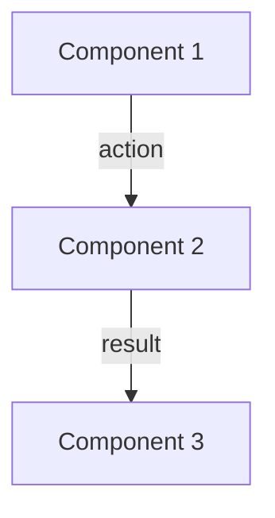
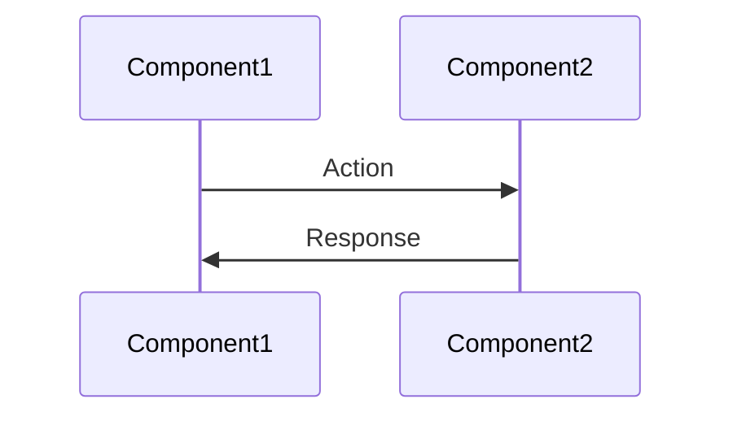
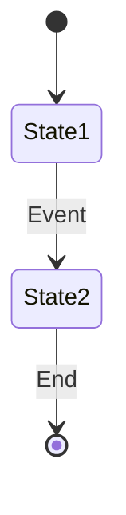
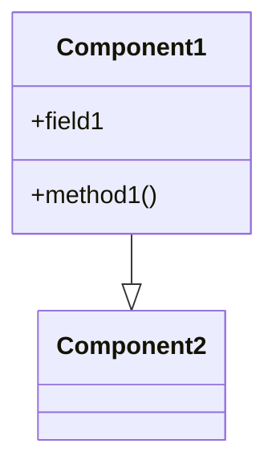

# Memory Bank Maintenance Guide

This guide provides practical suggestions and best practices for maintaining the Soma blockchain Memory Bank. It serves as a complementary resource to the overall documentation strategy.

## Memory Bank Purpose

The Memory Bank serves as a comprehensive knowledge repository that:
1. Provides efficient context for AI agents
2. Captures cross-component relationships
3. Documents workflows spanning multiple files
4. Reduces context window overhead
5. Facilitates smoother agent collaboration

## Document Creation and Update Guidelines

### When to Create New Memory Bank Documents

Create new documents when:
1. Implementing a significant new feature
2. Adding a new module or component
3. Identifying a knowledge gap in the current documentation
4. Discovering a workflow that spans multiple components
5. Implementing a new architectural pattern

### When to Update Existing Documents

Update documents when:
1. Making significant changes to components
2. Refactoring code that affects documented workflows
3. Finding inaccuracies in existing documentation
4. Improving component relationships or diagrams
5. Before transitioning work between AI agents
6. Adding examples that clarify concepts

## Effective Document Structure

### Document Elements Checklist

Ensure each document includes:
- [ ] Clear purpose statement
- [ ] List of key components involved 
- [ ] Component relationship diagrams (using Mermaid)
- [ ] Detailed explanations of workflows or concepts
- [ ] Practical code examples 
- [ ] Cross-references to related documents
- [ ] Confidence rating (1-10)
- [ ] Last updated timestamp

### Best Practices for Each Document Type

#### Core Documents
- Focus on high-level architectural concepts
- Explain why certain patterns or approaches were chosen
- Keep technical details minimal, reference other documents instead
- Update when making architectural decisions

#### Knowledge Documents
- Focus on cross-component workflows
- Include detailed diagrams showing data/control flow
- Provide concrete code examples
- Explain how components interact
- Address error handling and edge cases

#### Module Documents
- Document primary module responsibilities
- List key components and their relationships
- Explain module interfaces with other parts of the system
- Document important implementation patterns used

#### Active Documents
- Document current work in progress
- Track upcoming priorities
- Note recent changes that affect multiple components
- Identify challenges or blockers

## Effective Diagram Creation

### Mermaid Diagram Types

The Memory Bank uses Mermaid diagrams to visualize relationships. Choose the appropriate diagram type:

#### 1. Flowcharts for Component Relationships


**When to use**: For showing high-level component relationships and data flow.

#### 2. Sequence Diagrams for Workflows


**When to use**: For showing detailed step-by-step interactions between components.

#### 3. State Diagrams for State Transitions


**When to use**: For showing state machines, lifecycle stages, or status transitions.

#### 4. Class Diagrams for Structural Relationships


**When to use**: For showing inheritance, composition, or detailed type relationships.

### Diagram Best Practices

1. **Keep it focused**: Limit diagrams to 5-10 components for readability
2. **Use consistent naming**: Match component names in diagrams to code
3. **Add meaningful labels**: Label arrows with actions or transformations
4. **Organize logically**: Arrange components to minimize crossing lines
5. **Add legend if needed**: Explain symbols or color-coding

## Practical Examples for Different Document Types

### Example: Core Document (systemPatterns.md)

Focus on documenting architectural patterns used across the system:

```markdown
# System Patterns

## Purpose and Scope
This document outlines the key architectural patterns used throughout the Soma blockchain.

## Key Patterns
- **Actor Model**: Used for component isolation and message-passing
- **Task Supervision**: Used for managing task lifecycles
- **Epoch-Based Reconfiguration**: Used for validator set changes

## Actor Model Pattern
[Diagram showing actor model implementation]

### When to use
- For isolating component functionality
- For asynchronous message processing
- For component lifecycle management

### Implementation
```rust
// Example implementation
```

### Usage Examples
[Examples from different modules]
```

### Example: Knowledge Document (data_flow.md)

Focus on cross-component workflows and data transformations:

```markdown
# Transaction Data Flow

## Purpose and Scope
This document describes the complete lifecycle of a transaction through the Soma blockchain.

## Components Involved
- **Client**: Submits transactions
- **Authority**: Validates and processes transactions
- **Consensus**: Orders transactions
- **Execution**: Applies transaction effects

## Transaction Lifecycle
[Diagram showing transaction flow]

### 1. Transaction Submission
[Detailed explanation with code examples]

### 2. Validation and Certification
[Detailed explanation with code examples]

### 3. Consensus Ordering
[Detailed explanation with code examples]

### 4. Execution and Effects
[Detailed explanation with code examples]

## Error Handling
[Error handling throughout the transaction lifecycle]
```

### Example: Module Document (authority.md)

Focus on module-specific design and functionality:

```markdown
# Authority Module

## Purpose and Scope
The Authority module is responsible for managing state, validating transactions, and executing transactions.

## Key Components
- **AuthorityState**: Central state manager
- **TransactionManager**: Handles transaction dependencies
- **EpochStore**: Manages epoch-specific data

## Module Structure
[Diagram showing module structure]

## Primary Workflows
1. **Transaction Processing**: [Details]
2. **State Management**: [Details]
3. **Epoch Transition**: [Details]

## Design Patterns
- Pattern 1: [Details]
- Pattern 2: [Details]
```

## Memory Bank Integration with Development

### Memory Bank Updates During Development

Integrate Memory Bank updates into your development workflow:

1. **Planning Phase**:
   - Review relevant Memory Bank documents
   - Identify documents that will need updating

2. **Implementation Phase**:
   - Make notes about cross-component changes
   - Capture new patterns or workflows

3. **Review Phase**:
   - Update affected Memory Bank documents
   - Create new documents if needed
   - Update confidence ratings and timestamps

4. **Transition Phase**:
   - When transitioning between agents, ensure Memory Bank is current
   - Document known issues or challenges in `current_tasks.md`

### Best Practices for Memory Bank Updates

1. **Make atomic updates**: Update related documents together
2. **Update diagrams**: Ensure diagrams reflect current architecture
3. **Check cross-references**: Ensure cross-references remain valid
4. **Maintain a changelog**: Note significant changes in document history
5. **Be honest about confidence**: Use confidence ratings to indicate document maturity
6. **Consider reader perspective**: Write for agents who lack your context

## Document Maintenance Schedule

Establish a regular maintenance schedule:

1. **After each significant feature**: Update affected documents
2. **Before major releases**: Review all high-priority documents
3. **Quarterly**: Review all documents for accuracy
4. **When introducing new agents**: Ensure Memory Bank is complete and current

## Using the Three Pillars Approach

Organize document updates around the three core knowledge pillars:

### Pillar 1: Core Data Flow
Focus on transaction lifecycle, object model/ownership, and commit processing:
- Update when changing transaction processing logic
- Update when modifying object model
- Update when changing commit processing
- Ensure end-to-end workflows are documented

### Pillar 2: System Coordination
Focus on consensus, committee management, and epoch transitions:
- Update when modifying consensus protocol
- Update when changing committee election/selection
- Update when modifying epoch transition logic
- Ensure coordination protocols are clearly documented

### Pillar 3: Deployment & Operations
Focus on node types, genesis, and lifecycle management:
- Update when changing node initialization
- Update when modifying validator behavior
- Update when changing network topology
- Ensure operational processes are clearly documented

## Confidence Rating System

Use confidence ratings to indicate document maturity:

- **1-3 (Low)**: Initial draft, may have gaps or inaccuracies
- **4-6 (Medium)**: Good coverage but may be missing details or examples
- **7-8 (High)**: Comprehensive coverage with examples and diagrams
- **9-10 (Very High)**: Complete, verified, and extensively reviewed

## Conclusion

The Memory Bank is a living knowledge repository that evolves with the Soma blockchain. By following these guidelines and maintaining these documents, we ensure that all agents working on the project have access to accurate, comprehensive, and practical documentation that facilitates effective development.

## Confidence: 9/10
This document provides comprehensive guidance for maintaining the Memory Bank. It covers all essential aspects of document creation, updates, and integration with the development process.

## Last Updated: 2025-03-08
