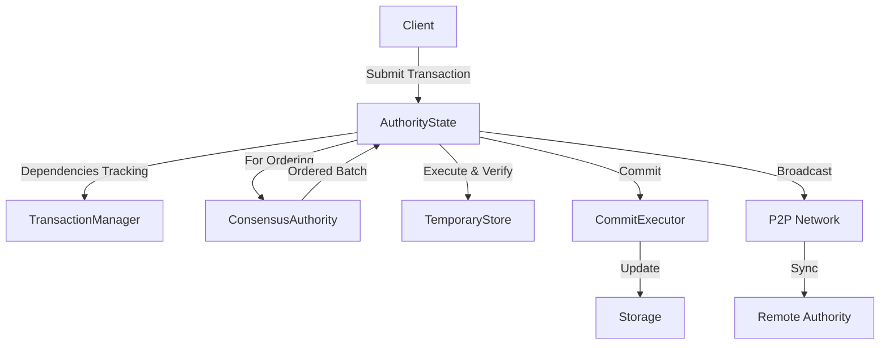
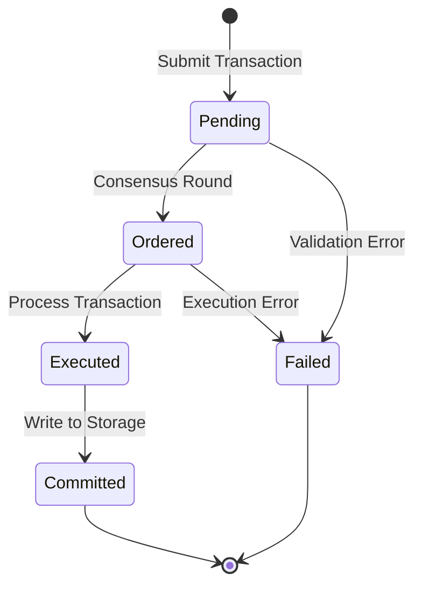
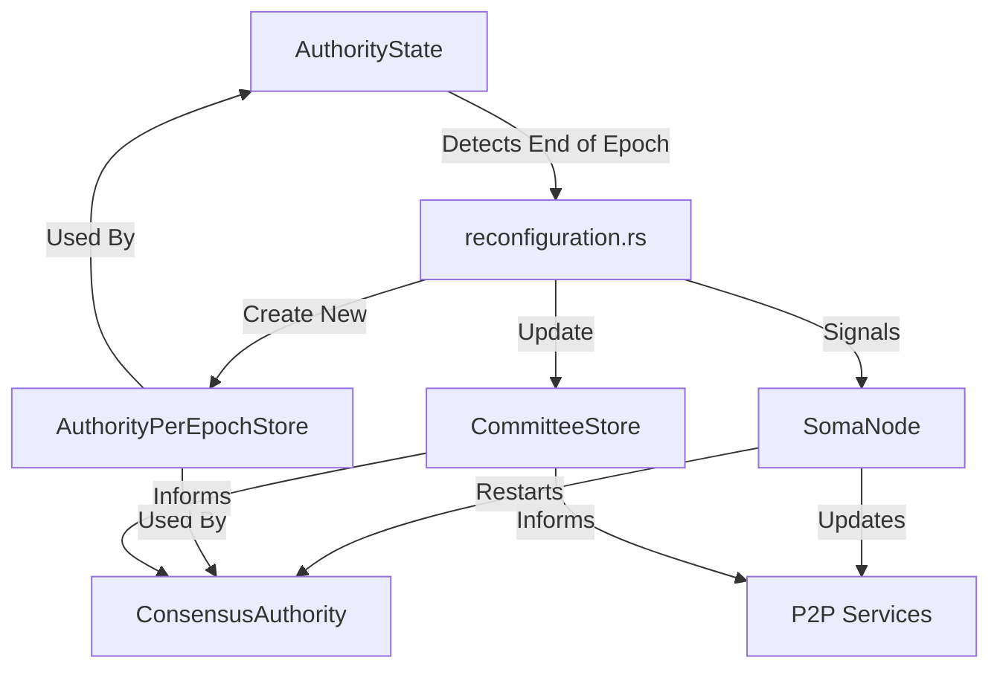
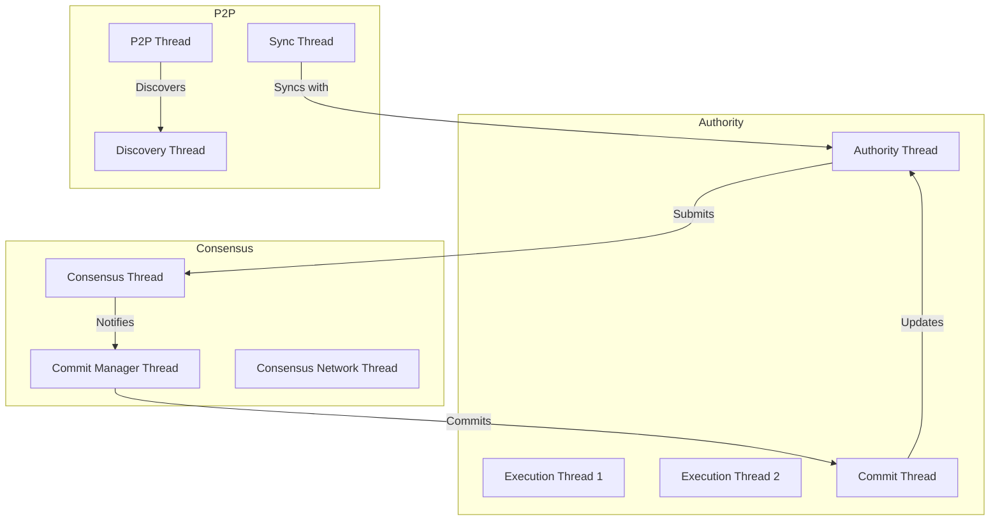

# Cross-File Documentation Suggestions

This document provides practical suggestions and examples for implementing cross-file documentation in the Soma blockchain codebase. It serves as a complementary resource to the overall documentation strategy.

## Example: Transaction Lifecycle Documentation

```markdown
# Transaction Lifecycle

## Purpose and Scope
This document explains the complete lifecycle of a transaction in the Soma blockchain, from when it is first submitted to the network until its effects are committed to the global state. Understanding this cross-component workflow is essential for developers working on transaction processing, consensus, or state management.

## Key Components
- **AuthorityState** (authority/src/state.rs): Handles transaction validation and execution
- **TransactionManager** (authority/src/tx_manager.rs): Manages transaction dependencies and scheduling
- **ConsensusAuthority** (consensus/src/authority.rs): Coordinates transaction ordering and commit
- **CommitExecutor** (authority/src/commit/executor.rs): Processes transaction commits to permanent storage
- **P2P State Sync** (p2p/src/state_sync/mod.rs): Propagates transaction information across network

## Component Relationships Diagram



## Critical Workflows

### 1. Transaction Submission and Validation
- Step 1: **Client** creates and submits a signed transaction to an **AuthorityState**
- Step 2: **AuthorityState.handle_transaction()** performs initial validation
- Step 3: **TransactionManager** checks dependencies and adds to pending queue
- Step 4: **AuthorityState** forwards the transaction to **ConsensusAuthority**

### 2. Transaction Ordering and Execution
- Step 1: **ConsensusAuthority** includes transaction in a proposal
- Step 2: Validators reach consensus on transaction ordering
- Step 3: **AuthorityState.execute_transaction()** runs execution logic
- Step 4: **TemporaryStore** tracks object mutations during execution
- Step 5: **Transaction effects** are computed based on execution

### 3. Transaction Commit and State Update
- Step 1: **CommitExecutor** receives ordered transaction batch
- Step 2: **CommitExecutor.commit_transaction()** writes to permanent storage
- Step 3: **AuthorityState** updates its in-memory state
- Step 4: **TransactionManager** clears dependencies and notifies waiters

## State Transitions



## Error Handling
- **Validation Failures**: Rejected by AuthorityState before consensus
  - Propagation: Error returned to submitter immediately
  - Recovery: Client must correct and resubmit
  
- **Execution Failures**: Occur after consensus but before commit
  - Propagation: Failure recorded in transaction effects
  - Recovery: Still committed with failure status to maintain determinism

- **Commit Failures**: Storage-level errors during commit
  - Propagation: Authority halts or initiates recovery procedure
  - Recovery: Authority performs state recovery from peers

## Threading and Concurrency Model
- **AuthorityState**: Uses RwLock for concurrent read access to state
- **TransactionManager**: Uses fine-grained locking per transaction/object
- **TemporaryStore**: Single-threaded during transaction execution
- **Consensus Core**: Runs in dedicated thread (core_thread.rs)
- **Commit Executor**: May use thread pool for parallel commits

## Configuration Parameters
- **max_pending_transactions**: Limits transactions in TransactionManager queue
- **execution_timeout_ms**: Maximum time allowed for transaction execution
- **consensus_submission_throttle**: Rate limit for consensus submissions

## Evolution History
- Originally used a synchronous execution model that limited throughput
- Added TransactionManager to track dependencies and enable concurrent execution
- Separated commit process to allow for optimistic execution

## Open Questions / Future Work
- Consider separating validation and execution phases more cleanly
- Evaluate whether transaction execution can be parallelized further
- Implement priority-based scheduling for different transaction types
```

## Example: Epoch Reconfiguration Documentation

```markdown
# Epoch Reconfiguration Process

## Purpose and Scope
This document explains how the Soma blockchain transitions between epochs, including committee changes, state updates, and service reconfiguration. This is a critical cross-component process that affects authority state, consensus, and networking components.

## Key Components
- **AuthorityState** (authority/src/state.rs): Manages epoch-specific state
- **AuthorityPerEpochStore** (authority/src/epoch_store.rs): Stores per-epoch data
- **CommitteeStore** (types/src/committee.rs): Tracks validator committees
- **ConsensusAuthority** (consensus/src/authority.rs): Handles consensus reconfiguration
- **Node** (node/src/lib.rs): Orchestrates component lifecycle during reconfiguration

## Component Relationships Diagram



## Critical Workflows

### 1. Epoch Boundary Detection
- Step 1: **AuthorityState** processes system transaction setting epoch boundary
- Step 2: **reconfiguration.rs** computes next epoch's committee and parameters
- Step 3: **AuthorityState.reconfigure()** is called to initiate reconfiguration

### 2. Epoch Store Creation and Transition
- Step 1: **AuthorityState** creates new **AuthorityPerEpochStore** for next epoch
- Step 2: **CommitteeStore** is updated with new validator committee 
- Step 3: **ArcSwap** is used to atomically replace the active epoch store

### 3. Component Reconfiguration
- Step 1: **SomaNode** receives reconfiguration notification
- Step 2: **ConsensusAuthority** is gracefully shutdown and restarted
- Step 3: **P2P services** update peer tables and connection priorities

## Thread Safety
- **Reconfiguration Lock**: Prevents concurrent reconfiguration attempts
- **Execution Lock**: Ensures no transactions processed during critical phases
- **ArcSwap Pattern**: Atomically replaces epoch store for thread safety

## Error Handling
- **Reconfiguration Failure**: Node will attempt to recover by fetching state from network
- **Consensus Restart Failure**: Will attempt progressive backoff and retry
- **State Corruption**: Validators may perform full state reset and sync
```

## Template: Cross-Component Threading Model

```markdown
# Thread Management in Soma

## Purpose and Scope
This document explains how threading is managed across the Soma blockchain components, focusing on thread ownership, synchronization points, and potential deadlock scenarios. It serves as a guide for developers to understand the concurrency model and safely modify code that spans multiple components.

## Thread Ownership by Component

### AuthorityState
- **Main Thread**: Processes transaction requests and handles API calls
- **Execution Threads**: May use a thread pool for parallel transaction execution
- **Service Threads**: Handle background tasks like garbage collection

### Consensus
- **Core Thread**: Runs the main consensus state machine
- **Network Thread**: Handles incoming consensus messages
- **Commit Thread**: Processes commit notifications

### P2P
- **Discovery Thread**: Manages peer discovery operations
- **Sync Thread**: Handles state synchronization requests
- **Connection Threads**: One per active peer connection

## Synchronization Points

### Critical Section 1: Transaction Execution
- **Components**: AuthorityState, TransactionManager, TemporaryStore
- **Synchronization Mechanism**: Object-level locks in TransactionManager
- **Potential Issues**: Lock contention on hot objects

### Critical Section 2: Consensus Message Processing
- **Components**: ConsensusAuthority, NetworkClient
- **Synchronization Mechanism**: Message queue with single consumer
- **Potential Issues**: Queue overflow during high load

### Critical Section 3: State Updates
- **Components**: AuthorityState, CommitExecutor
- **Synchronization Mechanism**: RwLock on AuthorityState
- **Potential Issues**: Read starvation during heavy commit phases

## Deadlock Prevention

### Identified Risk Areas
1. **Lock Ordering**: TransactionManager → AuthorityState → Storage
   - **Prevention**: Always acquire locks in this specific order

2. **Cross-Component Wait**: Consensus waiting for Authority while Authority waits for Consensus
   - **Prevention**: Use timeouts for all cross-component calls

3. **Resource Exhaustion**: Thread pool saturation preventing progress
   - **Prevention**: Pool sizing and backpressure mechanisms

## Thread Visualization



## Common Concurrency Patterns

1. **Event Loop Pattern**: Used in consensus/core.rs and p2p/state_sync/mod.rs
   - Example: `tokio::select!` with multiple event sources

2. **Actor Model Pattern**: Used for isolated components with message passing
   - Example: ConsensusAuthority communicating through channels

3. **ArcSwap Pattern**: Used for atomic reference replacement
   - Example: Epoch store replacement during reconfiguration
```

## Implementation Guidelines

### When to Create a New Cross-File Document

Create a new cross-file document when:

1. You observe developers repeatedly asking questions about the same multi-component workflow
2. You find yourself duplicating the same explanations in multiple file comments
3. A component's behavior cannot be fully understood without context from other components
4. Configuration changes have ripple effects across multiple components
5. You identify a critical path through the system that spans multiple components

### How to Identify Cross-Component Relationships

1. **Analyze Import Statements**: Look for components that import many other components
2. **Trace Method Calls**: Follow execution paths across component boundaries
3. **Review Channel Usage**: Identify message passing between components
4. **Check Shared State**: Find state accessed by multiple components
5. **Watch for Events**: Look for event listeners across components

### Documenting Interfaces Between Components

For each cross-component interface, document:

1. **Contract Definition**: What each component promises to the other
2. **Input Requirements**: Preconditions that must be met
3. **Output Guarantees**: What the consumer can expect
4. **Error Handling**: How errors propagate across the boundary
5. **State Management**: How state changes are communicated
6. **Threading Model**: Thread ownership and synchronization requirements

### Using Mermaid Diagrams Effectively

1. **Component Diagrams**: Show high-level relationships
   ```mermaid
   flowchart TD
       A[AuthorityState] -->|uses| B[TransactionManager]
       A -->|submits to| C[Consensus]
       C -->|notifies| A
   ```

2. **Sequence Diagrams**: Illustrate interaction order
   ```mermaid
   sequenceDiagram
       Client->>AuthorityState: submit_transaction()
       AuthorityState->>TransactionManager: track_dependencies()
       AuthorityState->>Consensus: process_transaction()
       Consensus-->>AuthorityState: transaction_committed()
   ```

3. **State Diagrams**: Show state transitions
   ```mermaid
   stateDiagram-v2
       [*] --> Pending
       Pending --> Processing
       Processing --> Committed
       Processing --> Failed
       Committed --> [*]
       Failed --> [*]
   ```

## Document Maintenance Best Practices

1. **Ownership Assignment**: Designate primary owner for each cross-file document
2. **Update Triggers**: Define specific events that trigger document updates
3. **Review Schedule**: Set recurring dates for documentation review
4. **Version Tracking**: Include last updated date and confidence rating
5. **Integration with Code**: Add code comments that reference cross-file docs

## Common Cross-File Documentation Pitfalls

1. **Duplication without Centralization**: Duplicating information across file comments without creating a central reference
2. **Incompatible Design Descriptions**: Conflicting descriptions of the same system in different places
3. **Missing Interface Contracts**: Failing to document what components expect from each other
4. **Outdated Workflow Documentation**: Not updating cross-file docs when implementation changes
5. **Over-fragmentation**: Creating too many small cross-file documents instead of cohesive topics
